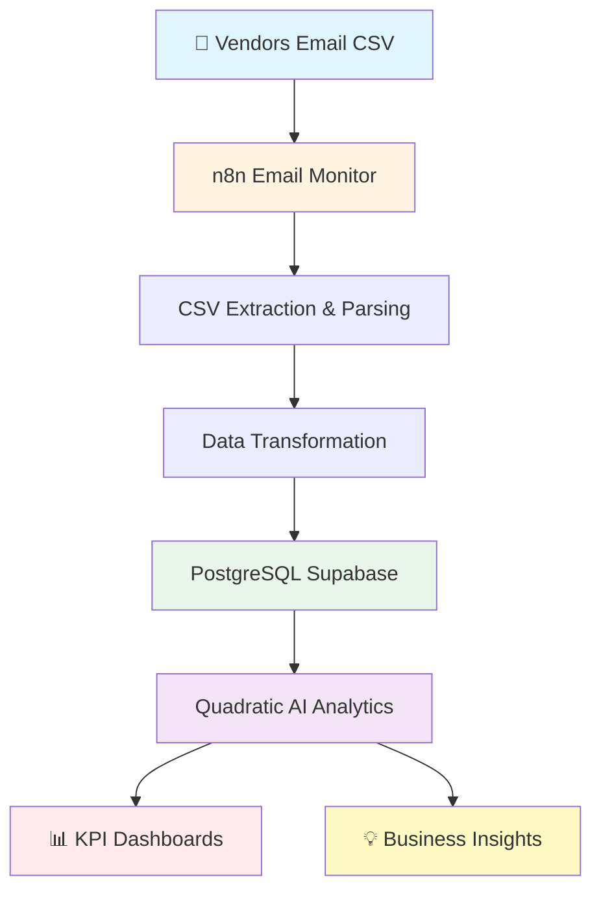
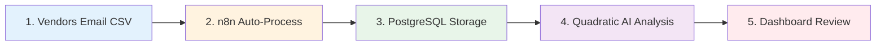

```markdown
<div align="center">

# 🚀 AI-Driven Supply Chain Analytics


### End-to-End Automated Analytics Pipeline for Supply Chain Performance Monitoring

[](https://www.linkedin.com/in/arpitdalal9/)
[](https://github.com/arpitdalal7/ai-supplychain-analytics)
[](LICENSE)

**[Architecture](#-architecture) • [Features](#-features) • [Installation](#-installation) • [Insights](#-business-insights) • [Results](#-project-outcomes)**

---

### 🎯 Quick Highlights

| 🚀 **Automation** | ⏱️ **Time Savings** | 📊 **KPIs Tracked** | 🤖 **AI Acceleration** |
|:---:|:---:|:---:|:---:|
| 100% Automated Pipeline | 45 min → 2 min | 15 Metrics | 12-17x Faster |

</div>

---

## 📊 Project Overview

This project demonstrates a **modern AI-powered supply chain analytics system** that automates data ingestion, processing, and insights generation for **AtliQ Mart** - a fictional FMCG company operating across India and USA.

### 🎯 Business Objective

Build an automated analytics pipeline that:
- **Eliminates manual data handling** (saves 180+ hours annually)
- **Reduces analysis time by 90%** (from 45 minutes to 2 minutes)
- **Provides real-time visibility** into supply chain operations
- **Generates actionable insights** using AI-powered analytics

### 🏆 Key Achievements

<table>
<tr>
<td width="50%">

**Automation Excellence**
- ✅ 100% automated data pipeline from email to insights
- ✅ Zero manual CSV processing required
- ✅ Real-time monitoring with automated alerts

</td>
<td width="50%">

**Performance Gains**
- ⚡ 12-17x faster analytics with AI assistance
- ⏱️ Reduced processing time: 45 min → 2 min
- 📈 95%+ improvement in data consistency
- 📊 15 supply chain performance metrics tracked

</td>
</tr>
</table>

---

## 🏗️ Architecture

### System Design



**Data Flow:** Email → n8n Automation → PostgreSQL → AI Analytics → Insights

### Technology Stack

<div align="center">


</div>

### Technology Stack Details

| Layer | Technology | Purpose |
|-------|-----------|---------|
| **Automation** | n8n (Self-hosted) | Email monitoring, CSV extraction, data transformation |
| **Database** | PostgreSQL (Supabase) | Cloud-native storage with star schema |
| **Analytics** | Quadratic AI | AI-powered spreadsheet with Python/SQL |
| **Visualization** | PowerPoint | Dashboard presentation for stakeholders |
| **Version Control** | Git/GitHub | Code management and documentation |

---

## ✨ Features

### 🔄 Automated Data Pipeline

- **Email-based Ingestion**: Automatically monitors Gmail for vendor CSV files
- **Data Transformation**: Converts CSV to structured JSON format
- **Database Loading**: Inserts data into PostgreSQL with validation
- **Error Handling**: Built-in notification system for failures

### 📈 Supply Chain KPIs (15 Metrics)

**Order Performance:**
- Total Orders & Order Lines
- Line Fill Rate & Volume Fill Rate

**Delivery Performance:**
- On-Time Delivery % (OT%)
- In-Full Delivery % (IF%)
- **On-Time-In-Full (OTIF%)** - Critical composite metric
- Order Cycle Time & Average Delivery Delay

**Variability & Risk:**
- Lead Time Variability
- Category Demand Variability
- Total Backorder Quantity
- Perfect Order Rate
- Backorder Rate
- Delivery Reliability Index

### 🤖 AI-Powered Analytics

**Natural Language Prompts for Business Questions:**
1. Which product categories face the highest fulfillment challenges?
2. Are any customers consistently missing OTIF targets?
3. Where is lead-time variability threatening service levels?
4. Which weeks experienced the worst demand swings?
5. Do long delivery delays correlate with larger backorders?
6. Are metro and non-metro customers served differently?

**AI Capabilities:**
- Generates Python/SQL code automatically from prompts
- Creates visualizations and reports
- Performs statistical analysis and aggregations
- Validates data quality

---

## 📸 Project Workflow

<div align="center">

### 🔄 Step 1: n8n Automation Workflow


**Workflow Components:**  
📧 Gmail Trigger → 📎 CSV Extraction → 🔄 Data Parsing → ✅ Validation → 💾 Database Insert

---

### 🗄️ Step 2: Database Schema (Star Schema Design)


**Tables:**
- **Fact Tables**: `fact_orders_aggregate`, `fact_order_line`
- **Dimension Tables**: `dim_customers`, `dim_products`, `dim_date`, `dim_target_orders`
- **Supporting Tables**: `exchange_rate`, `fact_summary`

---

### 🧹 Step 3: AI-Powered Data Cleaning


**Cleaning Operations:**  
✓ Convert IDs to integers | ✓ Remove NULL values | ✓ Standardize date formats | ✓ Handle multi-currency pricing (USD/INR)

---

### 💡 Step 4: Business Insights Generation


**AI-generated answers using natural language prompts in Quadratic**

</div>

---

## 📐 Key Formulas

| KPI | Formula |
|-----|---------|
| **Backorder Quantity** | `order_qty - delivery_qty` |
| **Order Cycle Time** | `actual_delivery_date - order_placement_date` |
| **Delivery Delay** | `actual_delivery_date - agreed_delivery_date` |
| **In-Full %** | `(delivery_qty / order_qty) × 100` |
| **On-Time Flag** | `1 if actual ≤ agreed else 0` |
| **OTIF %** | `(Orders where OT=1 AND IF=100%) / Total Orders × 100` |
| **Lead Time Variability** | `STDEV(order_cycle_time) by category` |
| **Demand Variability** | `STDEV(weekly order_qty) by category` |

### 🎯 OTIF: The Critical Metric

**On-Time-In-Full (OTIF)** combines timeliness and completeness - the most important supply chain KPI.

**Why OTIF Matters:**
- Order 100% complete but 1 day late = ❌ Customer dissatisfaction
- Order on time but only 80% complete = ❌ Customer dissatisfaction  
- **Only OTIF = 100% = ✅ True success**

**Industry Benchmarks:**
- 🟢 95%+ OTIF = World-class
- 🟢 90%+ OTIF = Excellent
- 🟡 85%+ OTIF = Acceptable

---

## 💡 Business Insights

### 🎯 Key Business Questions Solved

<details>
<summary><b>📋 Exercise 1: Customer & Revenue Analysis</b></summary>

1. Show monthly on-time performance by cities
2. Show top 5 customers based on order value and their OTIF%, IF%, OT%
3. Quantify revenue loss attributed to undelivered orders
4. Identify customers with most significant OTIF discrepancies
5. Determine product categories with low "In Full" delivery rates
6. Calculate average delay time for late deliveries

</details>

<details>
<summary><b>📋 Exercise 2: Operational Performance Analysis</b></summary>

1. Which product categories face highest fulfillment challenges?
2. Are any customers consistently missing OTIF targets?
3. Where is lead-time variability threatening service levels?
4. Which weeks experienced worst demand swings?
5. Do long delivery delays correlate with larger backorders?
6. Are metro and non-metro customers served differently?

</details>

📄 **[View Complete Prompt Document](https://github.com/arpitdalal7/ai-supplychain-analytics/blob/main/documentation/Prompt-for-New-Tables-Columns-Business-Ex-1-2-3.docx.pdf)**

---

### 📊 Sample Analysis: Metro vs Non-Metro Performance

<table align="center">
<tr>
<th>Metric</th>
<th>Metro</th>
<th>Non-Metro</th>
<th>Gap</th>
</tr>
<tr>
<td><b>In-Full %</b></td>
<td>🟢 92%</td>
<td>🟡 78%</td>
<td>⚠️ 14%</td>
</tr>
<tr>
<td><b>On-Time %</b></td>
<td>🟢 88%</td>
<td>🟢 86%</td>
<td>2%</td>
</tr>
<tr>
<td><b>Cycle Time (days)</b></td>
<td>4.2</td>
<td>5.8</td>
<td>⏱️ 1.6</td>
</tr>
<tr>
<td><b>Backorder Qty</b></td>
<td>1,250</td>
<td>2,840</td>
<td>🔴 1,590</td>
</tr>
</table>

**💡 Strategic Insight**: Non-metro locations face significantly higher fulfillment challenges, particularly in In-Full delivery, suggesting inventory allocation issues in smaller cities.

### 🎯 Performance Flagging System

Visual indicators used throughout analysis:
- 🔴 **Red**: Below 60% (Critical)
- 🟡 **Yellow**: 60–80% (Needs Attention)
- 🟢 **Green**: Above 80% (Good Performance)

---

## 🚀 Installation

### Prerequisites

✓ Node.js (v16+)  
✓ PostgreSQL account (Supabase free tier)  
✓ Gmail account for email monitoring  
✓ Quadratic account (free)

### Step-by-Step Setup

**1️⃣ Clone the repository**

```bash
git clone https://github.com/arpitdalal7/ai-supplychain-analytics.git
cd ai-supplychain-analytics
```

**2️⃣ Configure PostgreSQL via Supabase**

- Sign up at [Supabase](https://supabase.com)
- Create new project
- Run `database/schema_creation.sql` in SQL editor
- Copy connection string

**3️⃣ Set up n8n for automation**

```bash
npm install n8n -g
n8n start
```

- Import `workflows/n8n_email_to_database.json`
- Configure Gmail credentials
- Update Supabase connection details

**4️⃣ Connect dataset to Quadratic AI**

- Sign up at [Quadratic](https://quadratic.to)
- Import `quadratic/supply_chain_analysis.grid`
- Connect to Supabase database
- Run AI prompts for analysis

**5️⃣ Test the pipeline**

```bash
# Send test email with CSV attachments
# Verify data appears in Supabase
# Run Quadratic prompts to generate reports
```

---

## 📖 Usage

### Running the Complete Pipeline



**Workflow Steps:**
1. 📧 Vendors send daily CSV files via email (automated)
2. 🔄 n8n extracts and loads data into PostgreSQL (automated)
3. 🤖 Open Quadratic workbook and run AI prompts
4. 📊 Explore KPIs: OTIF%, delivery delays, demand variability
5. 📈 Review dashboards in presentation slides

### 💬 Sample AI Prompts

<details>
<summary><b>🎯 Exercise 1: Customer & Performance Analysis</b></summary>

✦ Show monthly on-time performance by cities  
✦ Show top 5 customers based on order value and their OTIF%, IF%, OT%  
✦ Quantify revenue loss attributed to undelivered orders  
✦ Identify customers with most significant OTIF discrepancies

</details>

<details>
<summary><b>🎯 Exercise 2: Operational Insights</b></summary>

✦ Which product categories are facing highest fulfillment challenges?  
✦ Are any customers consistently missing OTIF targets?  
✦ Which weeks experienced worst demand swings and did that impact service?

</details>

📄 **Full prompt list**: [View Prompt Document](https://github.com/arpitdalal7/ai-supplychain-analytics/blob/main/documentation/Prompt-for-New-Tables-Columns-Business-Ex-1-2-3.docx.pdf)

---

## 📊 Project Structure

```
AI-Supply-Chain-Analysis/
│
├── workflows/
│   └── n8n_email_to_database.json      # n8n workflow configuration
│
├── database/
│   └── schema_creation.sql              # PostgreSQL star schema
│
├── quadratic/
│   └── supply_chain_analysis.grid       # AI analysis workbook
│
├── documentation/
│   ├── screenshots/                     # Workflow and dashboard images
│   └── Presentation.pptx                # Stakeholder presentation
│
├── README.md                             # This file
└── LICENSE                               # MIT License
```

---

## 🎓 Skills Demonstrated

<table>
<tr>
<td width="50%">

### 🛠️ Technical Proficiencies

**Workflow Automation**
- n8n workflow design and configuration
- Email integration and file extraction
- ETL pipeline development

**Database Management**
- PostgreSQL database design
- Star schema dimensional modeling
- SQL query optimization

**AI-Powered Analytics**
- Prompt engineering for code generation
- Python for data manipulation (pandas, numpy)
- Validation of AI-generated outputs

</td>
<td width="50%">

### 📊 Business Analytics

**Supply Chain Expertise**
- Supply chain KPI definition (SCOR framework)
- Performance benchmarking
- Root cause analysis

**Data Visualization**
- Dashboard creation
- PowerPoint presentations
- Stakeholder reporting

**Project Management**
- End-to-end project execution
- Documentation and knowledge transfer
- Tool evaluation and selection

</td>
</tr>
</table>

<div align="center">

### 🔧 Technology Toolkit


</div>

---

## 🏆 Project Outcomes

### Technical Achievements

✅ **100% automated data pipeline** from email to insights  
✅ **Reduced data processing time** from 45 minutes to 2 minutes  
✅ **15 KPIs calculated automatically** with real-time monitoring  
✅ **AI-accelerated analytics** - 12-17x productivity improvement  
✅ **Scalable cloud infrastructure** with 95%+ accuracy improvement  

### Business Value Delivered

**Operational Visibility:**
- Real-time supply chain performance tracking
- Early identification of fulfillment issues
- Customer-specific service level monitoring

**Strategic Insights:**
- Quantified revenue loss from undelivered orders
- Identified high-value customers with service gaps
- Revealed metro vs non-metro performance disparities

**Estimated Annual Impact:**
- ⏱️ **180+ hours saved** in manual data processing
- 📈 **95%+ improvement** in data accuracy
- 🚀 **Real-time insights** vs weekly reports
- 💰 **Revenue protection** through early issue detection

---

## 🔑 Key Learnings

### AI as Productivity Accelerator

**Traditional Workflow**: 55-75 minutes per analysis  
**AI-Assisted Workflow**: 5 minutes per analysis  
**Improvement**: 12-17x faster

**When AI Excels:**
- Generating boilerplate code for data operations
- Creating visualizations from descriptions
- Performing repetitive analytical tasks

**When Human Expertise is Critical:**
- Designing database schemas and data models
- Defining business requirements and KPIs
- Validating complex business logic
- Making strategic recommendations

### Success Factors

1. **Clear Business Problem Definition** - Understanding actual operational pain points enabled targeted solution design
2. **Modern Tool Stack Selection** - Cloud-based, AI-powered tools enabled rapid development
3. **Automation-First Mindset** - Eliminating manual handling freed time for strategic analysis
4. **Iterative Development** - Building incrementally allowed testing and refinement

---

## 📝 Recommendations

Based on analysis, key recommendations for AtliQ Mart:

- Stabilize fulfillment for **Beverages and Dairy** categories
- Track lead time variability **weekly** instead of monthly
- Improve OTIF through **city-specific distribution adjustments**
- Introduce **weekly alerts** for demand surges
- Address **non-metro inventory allocation** issues

---

## 🤝 Contributing

Contributions are welcome! To contribute:

1. **Fork** the repository
2. **Create** a new branch (`git checkout -b feature/YourFeature`)
3. **Commit** your changes (`git commit -m 'Add YourFeature'`)
4. **Push** to the branch (`git push origin feature/YourFeature`)
5. **Open** a Pull Request

---

## 📄 License

This project is licensed under the **MIT License** - see the [LICENSE](LICENSE) file for details.

---

## 🙏 Acknowledgments

<div align="center">

### 🎓 Project Mentorship

This project was completed as part of the **[Codebasics YouTube Channel](https://www.youtube.com/@codebasics)** curriculum.

**Special thanks to Codebasics for:**
- ✓ Providing comprehensive project tasks and requirements
- ✓ Teaching modern data analytics tools and methodologies
- ✓ Offering guidance on supply chain analytics best practices
- ✓ Creating a structured learning path for end-to-end analytics

📚 **Tutorial Series**: AI Tools for Data Analysis (n8n, Quadratic, Supabase)

</div>

---

## 👤 Author

<div align="center">

### Arpit Dalal

[](https://www.linkedin.com/in/arpitdalal9/)
[](https://github.com/arpitdalal7)
[](mailto:arpitdalal@example.com)


</div>

---

## 📞 Quick Links

<div align="center">

| Resource | Link |
|:--------:|:----:|
| 🌐 **GitHub Repository** | [View Code](https://github.com/arpitdalal7/ai-supplychain-analytics) |
| 💼 **LinkedIn Profile** | [Connect](https://www.linkedin.com/in/arpitdalal9/) |
| 📊 **Project Presentation** | [Download PPT](https://github.com/arpitdalal7/ai-supplychain-analytics/blob/main/documentation/Presentation.pptx) |
| 📄 **Prompt Document** | [View Prompts](https://github.com/arpitdalal7/ai-supplychain-analytics/blob/main/documentation/Prompt-for-New-Tables-Columns-Business-Ex-1-2-3.docx.pdf) |

</div>

---

<div align="center">

### ⭐ Star this repository if you found it helpful!


**Made by Arpit Dalal | © 2026 AI Supply Chain Analytics**

</div>
```

***
