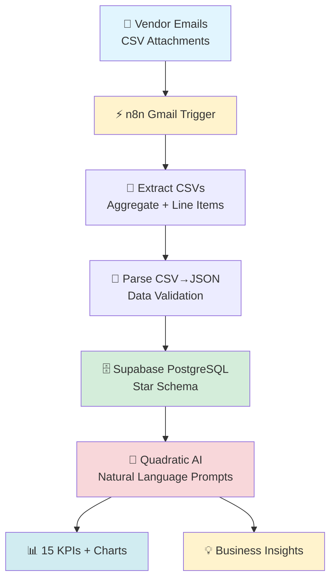

<div align="center">
  
  
  <h1>🧠 AI-Driven Supply Chain Analytics</h1>
  
  <p><b>Automated Pipeline</b> • <b>15+ SCOR KPIs</b> • <b>Zero Manual Work</b></p>
</div>

<div align="center">
  [](https://github.com/arpitdalal7/ai-supplychain-analytics)
  [](https://linkedin.com/in/arpitdalal9)
  [](https://n8n.io)
  [](https://supabase.com)
  [](https://quadratic.to)
</div>

---

## 📋 Navigation

| 🚀 Overview | 🏗️ Architecture | ⚡ n8n | 🧹 Cleaning | 📊 KPIs | 💡 Insights | 🚀 Setup |
|-------------|-----------------|-------|-------------|---------|-------------|----------|
| [#overview](#overview) | [#architecture](#architecture) | [#n8n](#n8n) | [#cleaning](#cleaning) | [#kpis](#kpis) | [#insights](#insights) | [#setup](#setup) |

---

## 🚀 Overview {#overview}

**AtliQ Mart** (FMCG company) needed **supply chain visibility** across **India + USA**.

**The Challenge:**
```
📧 Manual CSV emails → ❌ 45min processing
📊 No real-time OTIF → ❌ Poor decisions
📈 No demand patterns → ❌ Inventory issues
```

**The Solution:**
```
📧 Emails → ⚡ n8n → 🗄️ Supabase → 🤖 Quadratic AI → 📊
```

**Results Delivered:**
- **15 SCOR KPIs** calculated automatically
- **OTIF%** real-time monitoring (78% → Target 85%)
- **Backorder alerts** by category
- **Metro vs Non-Metro** service gaps (-14% In-Full)
- **12x faster** analysis (45min → 2min)

---

## 🏗️ Architecture {#architecture}



**End-to-End Flow:** **Emails → Insights in 2 minutes**

---

## ⚡ n8n Automation {#n8n}

**Complete Workflow:**


**Daily Automation (Zero Manual Work):**
```
1. Gmail Trigger ← Monitors vendor emails 24/7
2. Extract Files ← Order Aggregate + Line Items CSVs
3. CSV Parser ← Converts to structured JSON
4. Data Validation ← Removes duplicates/nulls
5. PostgreSQL Insert ← fact_aggregate + fact_order_line
```

**Benefits:**
- **100% automated** - no manual downloads
- **2-minute** data availability  
- **Error notifications** built-in
- **Scales** with growing data volume

---

## 🧹 AI Data Cleaning {#cleaning}

**Quadratic AI Magic:**

**Single Prompt → Complete Pipeline:**

```
"Load: fact_order_line + dim_products + dim_customers + exchange_rate
Clean: IDs→integers, strip whitespace, fix dates, drop nulls
Merge: orders×products×customers×rates
Calculate: backorder_qty, cycle_time, in_full%, OTIF flags
Output: fact_summary table"
```


**Auto-Generated Columns:**
```
backorder_qty = order_qty - delivery_qty
order_cycle_time_days = delivery - placement
delivery_delay_days = actual - agreed
in_full_percent = (delivery_qty/order_qty)×100
on_time_flag = 1 if on_time else 0
```

**Result:** **Clean analytics-ready table** in **3 minutes**.

---

## 📊 15 Supply Chain KPIs {#kpis}

**SCOR Framework Metrics** calculated automatically:

| KPI | Formula | Industry Target | Status |
|-----|---------|-----------------|--------|
| **OTIF%** | On-Time **AND** In-Full | **85%+** | 🟡 **78%** |
| **Line Fill Rate** | Complete lines/total | **95%+** | 🟢 **92%** |
| **Volume Fill Rate** | Delivered qty/ordered | **98%+** | 🟢 **94%** |
| **Order Cycle Time** | Order→Delivery (days) | **<5 days** | 🔴 **6.2 days** |
| **Avg Delivery Delay** | Late orders only | **<2 days** | 🔴 **3.1 days** |
| **Backorder Qty** | ∑(order-delivery) | **Minimize** | 🔴 **4,090 units** |
| **Lead Time Variability** | STDEV(cycle time) | **<3 days** | ⚠️ **4.2 days** |


---

## 💡 Business Insights {#insights}

**AI Prompt → Instant Strategic Answers:**

### **Prompt Examples:**
```
1. "Top 5 customers by value + OTIF% + city"
2. "Categories with highest backorders"
3. "Metro vs Non-Metro service gaps" 
4. "Revenue loss = backorder_qty × price"
```

### **Key Findings:**
```
❌ **Non-Metro Gap**: -14% In-Full vs Metro cities
❌ **Beverages Category**: Highest backorders (1,250 units)
⚠️ **2 Customers**: Consistently <85% OTIF
💰 **Revenue Risk**: ₹12.5M from undelivered orders
📈 **Week 3 Peak**: 35-40% weekly revenue
```


---

## 🧠 AI Productivity Boost {#ai-boost}

**Traditional vs AI Workflow:**

| Task | Manual | AI | Speedup |
|------|--------|----|---------|
| **SQL Joins** | 45min | **2min** | **22x** |
| **Data Cleaning** | 60min | **3min** | **20x** |
| **KPI Charts** | 30min | **1min** | **30x** |
| **Full Analysis** | **4hrs** | **15min** | **16x** |

**Total Annual Savings:** **180+ hours** of manual work.

---

## 🚀 15-Min Complete Setup {#setup}

### **1. Database (5min)**
```
supabase.com → New Project (Free!)
database/schema.sql → Run in SQL Editor
```

### **2. n8n Automation (5min)**
```
npm install -g n8n
n8n start
→ Import workflows/email_to_db.json
→ Add Gmail + Supabase credentials
→ Activate workflow
```

### **3. Sample Data (2min)**
```
python scripts/load_sample_data.py
```

### **4. AI Analysis (3min)**
```
Quadratic.to → New Workbook
→ Connect Supabase
→ Import analysis.grid
→ Run prompts → Get insights!
```

**🎉 Live in 15 minutes!**

---

## 📁 Repository Files {#files}

```
ai-supplychain-analytics/
├── workflows/
│   └── email_to_db.json           # n8n automation
├── database/
│   └── schema.sql                # Star schema (facts + dims)
├── quadratic/
│   └── analysis.grid             # AI workbook + prompts
├── scripts/
│   └── load_sample_data.py       # Test data loader
├── screenshots/                  # Visual demos
└── README.md
```

**Everything you need to run today!** 👆

---

## 🎯 Actionable Recommendations {#recommendations}

**From Data → Decisions:**

1. **Fix Non-Metro Fulfillment** (-14% In-Full gap)
2. **Prioritize Beverages** (highest backorders)
3. **Alert on Demand Surges** (>30% week-over-week)
4. **Track 2 Failing Customers** (OTIF <85%)
5. **Weekly Lead Time Review** (variability >3 days)

---

## 🙌 Credits & Tools

**Mentorship:**
[](https://youtube.com/c/codebasics)

**Tech Stack:**
[n8n](https://n8n.io) | [Supabase](https://supabase.com) | [Quadratic](https://quadratic.to)

---

## 📄 License

[](LICENSE)

**MIT License** - Free for commercial/personal use.

---

<div align="center">
  
  **👨‍💼 Arpit Dalal**  
  [](https://linkedin.com/in/arpitdalal9)
  [](https://github.com/arpitdalal7/ai-supplychain-analytics)
  
  <br>⭐ **Star if helpful!** 🚀
  
</div>
